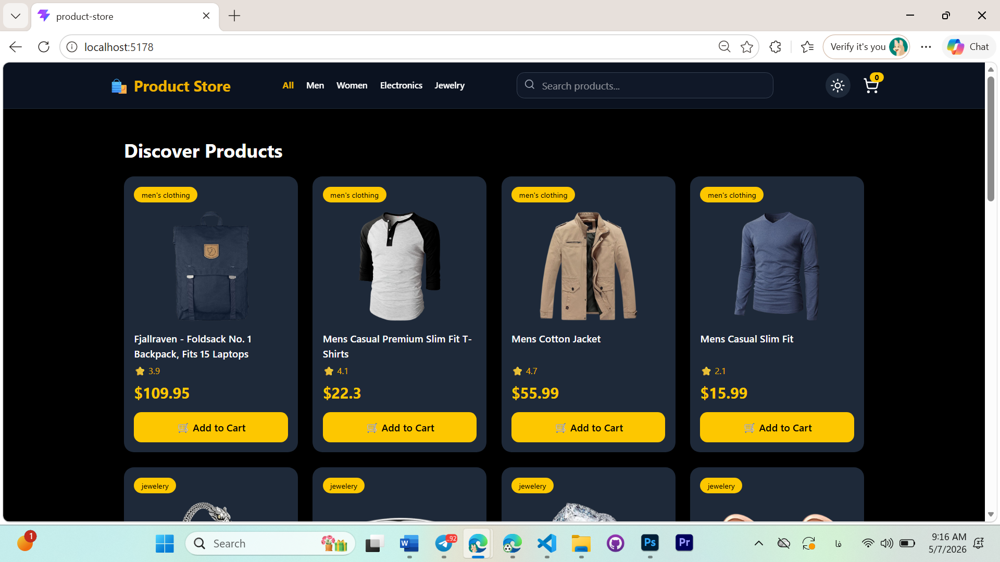
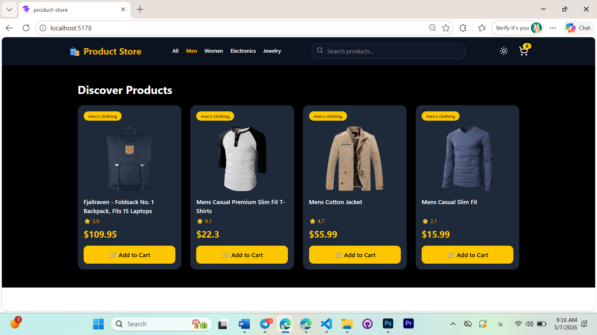
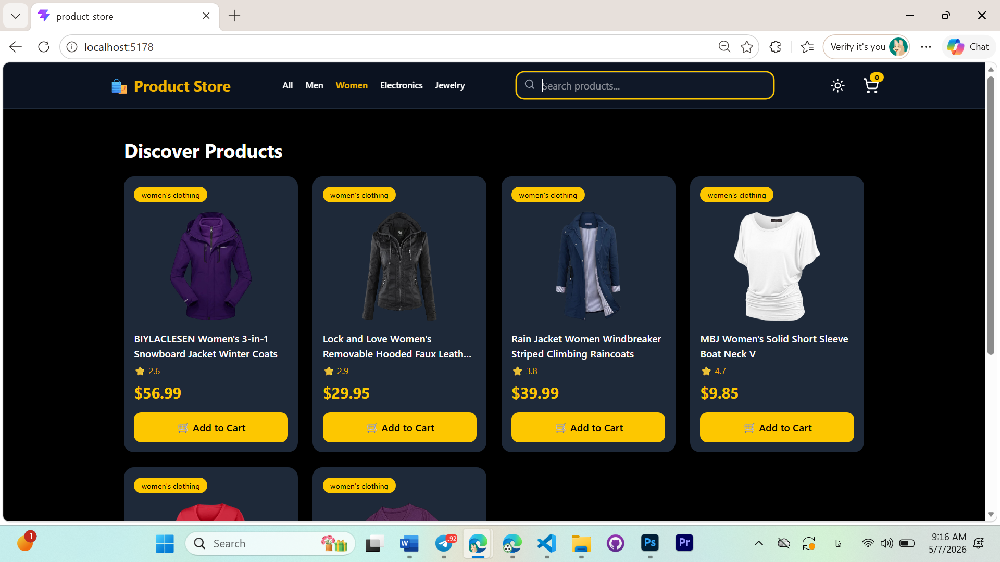

# Product Store App

A modern React Product Store application built for Week 9 Assignment using:

* Context API + useReducer
* Redux Toolkit
* React Query
* Tailwind CSS
* React Router

---

# Features

* Product listing from API
* Search products
* Filter by category
* Dark / Light mode
* Shopping cart with Redux Toolkit
* Add to cart
* Remove from cart
* Increase / decrease quantity
* Total items and total price
* Product details page
* Responsive design
* Modern UI/UX
* Loading skeleton animation

---

# Technologies Used

* React
* Vite
* Tailwind CSS
* Redux Toolkit
* React Redux
* React Query
* React Router DOM
* Axios
* Lucide React

---

# Project Structure

```bash
src/
│
├── app/
├── components/
├── context/
├── features/
├── hooks/
├── pages/
├── routes/
├── services/
└── main.jsx
```

---

# Installation

Clone the repository:

```bash
git clone YOUR_GITHUB_LINK
```

Install dependencies:

```bash
npm install
```

Run the project:

```bash
npm run dev
```

---

# Screenshots

## Home Page


---

## Dark Mode



---

## Shopping Cart



---

## Product Details



---

# Assignment Concepts Covered

## Context API + useReducer

* Theme management
* Search state
* Category filtering

## Redux Toolkit

* Cart state management
* Quantity control
* Total price calculation

## React Query

* Product fetching
* Loading states
* Error handling
* Cached API data

---

# Developed By

Marjan Habibi
Frontend Developer | UI Designer
